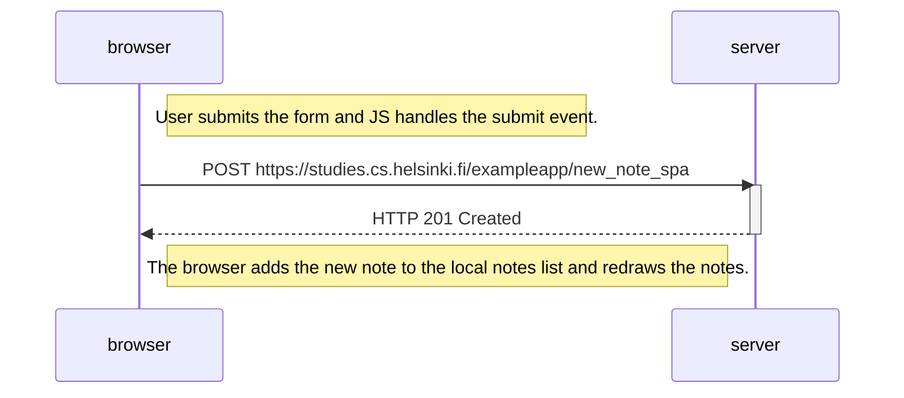

```mermaid
sequenceDiagram
    participant browser
    participant server

    Note right of browser: User submits the form and JS handles the submit event.

    browser ->> server: POST https://studies.cs.helsinki.fi/exampleapp/new_note_spa
    activate server
    server -->> browser: HTTP 201 Created
    deactivate server

    Note right of browser: The browser adds the new note to the local notes list and redraws the notes.

```