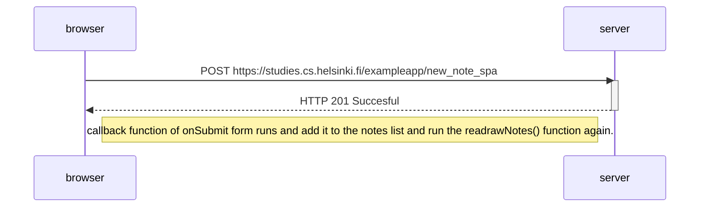

```mermaid
sequenceDiagram
    participant browser
    participant server

    browser ->> server: POST https://studies.cs.helsinki.fi/exampleapp/new_note_spa
    activate server
    server -->> browser: HTTP 201 Succesful
    deactivate server

    Note right of browser: callback function of onSubmit form runs and add it to the notes list and run the readrawNotes() function again.


```